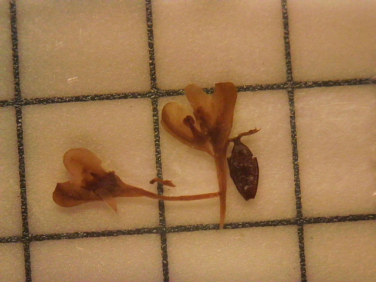

_______________________________________________________________________________
# Part 1

Add different header levels
Compare the output with different numbers of # in headers

# Big Header
## Medium Header
### Lil' Header
_______________________________________________________________________________

# Part 2

Blank space: add empty lines

<br>
<br>
I think I got this down!

_______________________________________________________________________________

# Part 3

Add in-line code

There are `r nrow(mtcars)` observations in the cars dataset, 
and `r ncol(mtcars)` variables.

```{r}
knitr::kable(
  mtcars[1:5, ], 
  caption = "A knitr kable."
)
```
_______________________________________________________________________________

# Part 4

Add images:

* With knitr::include_graphics()

```{r}

```
\center This is a photo of a knotweed flower and its organs! \center
\center I am practicing centering text on a pdf \center

```{r SIMPLE CHUNK #1, include=TRUE}
Hopper<-(4+6)
print(Hopper)
```

```{r SIMPLE CHUNK #2, include=TRUE}
circumference<-function(r){
  2*pi*r
}
circumference (2)
```
```{r SIMPLE CHUNK #3, include=TRUE}
area<-function(a,b){
  a*b
}
print(area(a=3, b=7))
```
